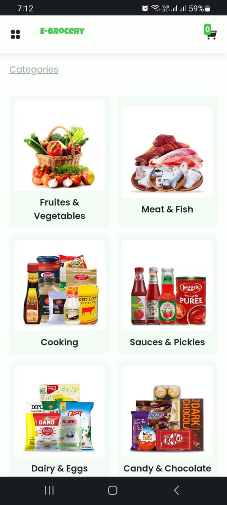

# E-Grocery

Welcome to E-Grocery, an online grocery shopping website where users can order essential grocery items categorized for easy navigation.



You can access the live website at [https://mubtasim-e-grocery.netlify.app/](https://mubtasim-e-grocery.netlify.app/)

## Table of Contents

- [Features](#features)
- [Getting Started](#getting-started)

## Features

- User-friendly interface for easy navigation and ordering.
- Categories for well-organized grocery items.
- Add items to your cart and proceed to checkout.
- Responsive design for both desktop and mobile devices.
- Place orders and receive confirmation.

## Getting Started

To run this project locally, follow these steps:

1. Clone the repository to your local machine:

   ```bash
   git clone https://github.com/mubtasim/e-grocery.git
   ```

2. Navigate to the project directory:

   ```
   cd e-grocery
   ```

3. Open the index.html file in your preferred web browser.
